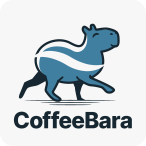

  

# CoffeeBara Cafe

This is a website created for the CoffeeBara Cafe. The website is designed to provide information about the cafe, including its menu, location, and hours of operation.

## Technologies Used

The website is built using HTML, CSS, and JavaScript. The following libraries and frameworks are also being used in the development of the website:

- Bootstrap - for responsive design
- jQuery - for DOM manipulation
- Google Maps API - for displaying the location of the cafe (TBA)

## Design and Implementation

The website was designed to have a clean and modern look, with a focus on simplicity and ease of use. The homepage features a bold hero landing page showcasing its products, as well as a brief introduction to the cafe.

The navigation menu allows users to easily access the different pages of the website, including the menu, location, and about us page. The menu page provides information about the cafe's products, including coffee, tea, and snacks.

The location page includes the location of the cafe, as well as address and contact information. The about us page provides information about the history and mission of the cafe.

The website was developed using a mobile-first approach, with a responsive design that adapts to different screen sizes.

## Roadmap for Future Development

Some possible improvements that could be made to the website in the future include:

- Adding online ordering functionality
- Integrating with social media platforms
- Providing nutritional information for menu items
- Adding more items to the menu
- Implementing an e-commerce API to pull menu information

## Conclusion

I'm sure I'm forgetting some stuff since this is a work in progress but overall, the CoffeeBara Cafe website was developed to provide a simple and user-friendly experience for visitors to the cafe. The website was built using modern web technologies and frameworks to ensure a responsive and visually appealing design. With potential future improvements, the website can continue to enhance the user experience and help the cafe grow its customer base.